# 🏝️ Language Island

<div align="center">


## Learn • Play • Earn

*A gamified language learning platform designed for children and beginners.*

</div>

---

<p align="center">
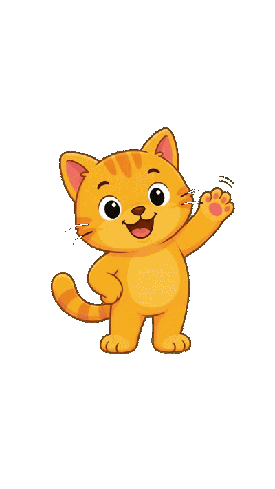
</p>

---

# 📖 Overview

**Language Island** is an interactive language learning platform designed for children and beginners. It combines education with fun through games, interactive books, educational videos, pronunciation practice, listening activities, and digital drawing.

The platform supports **English, Spanish, French, German, Italian, and Arabic**, helping learners improve their reading, listening, speaking, and vocabulary skills in an engaging way. Users earn **coins** and **stars** by completing activities, which can be used to unlock **Catto skins**, **themes**, books, and other rewards in the virtual shop.

With a personalized profile and the friendly **Catto Companion**, Language Island creates an enjoyable learning experience that encourages daily practice and continuous progress.

---

# 📸 Screenshots

## 🏠 Home
<p align="center">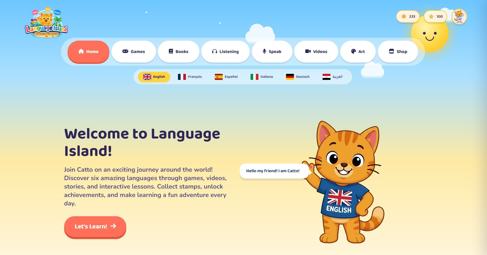</p>

## 🔐 Sign In
<p align="center">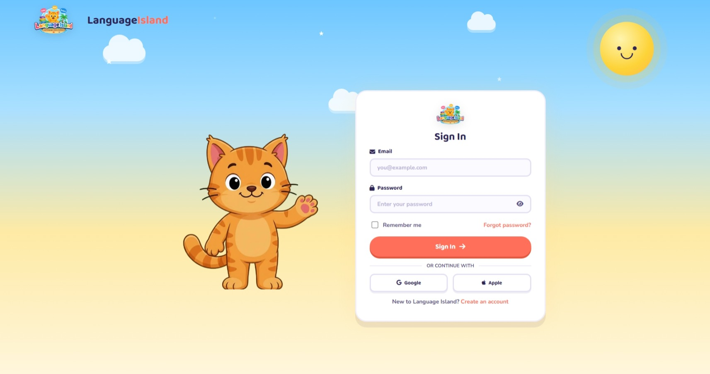</p>

## 📝 Sign Up
<p align="center">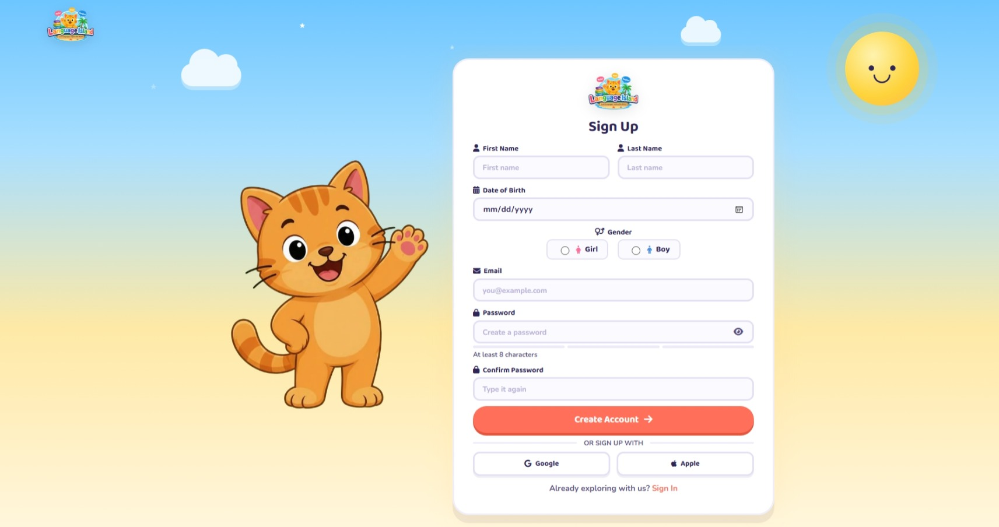</p>

## 🎥 Videos
<p align="center">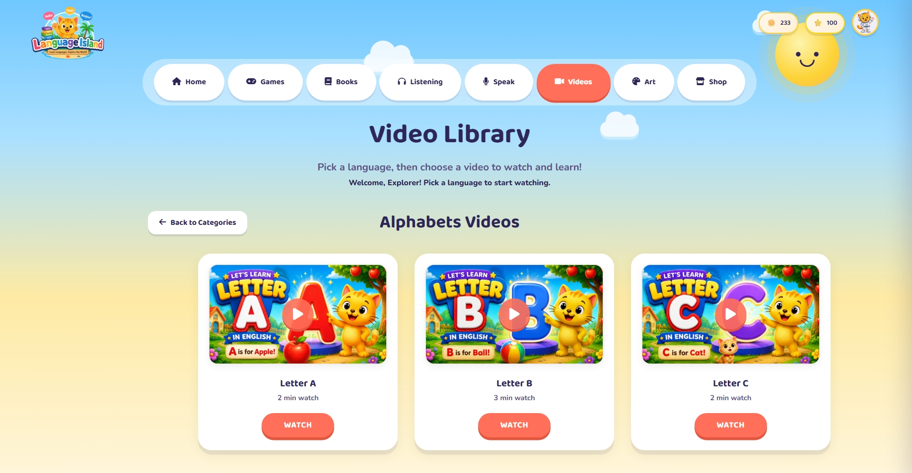</p>

## 🎮 Games
<p align="center">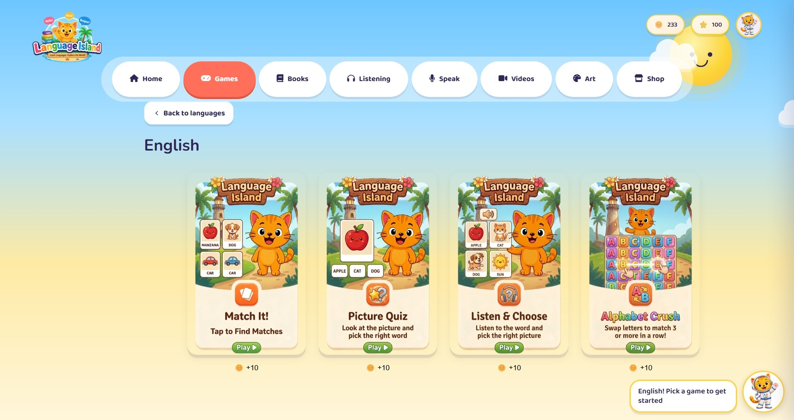</p>

## 📚 Books
<p align="center">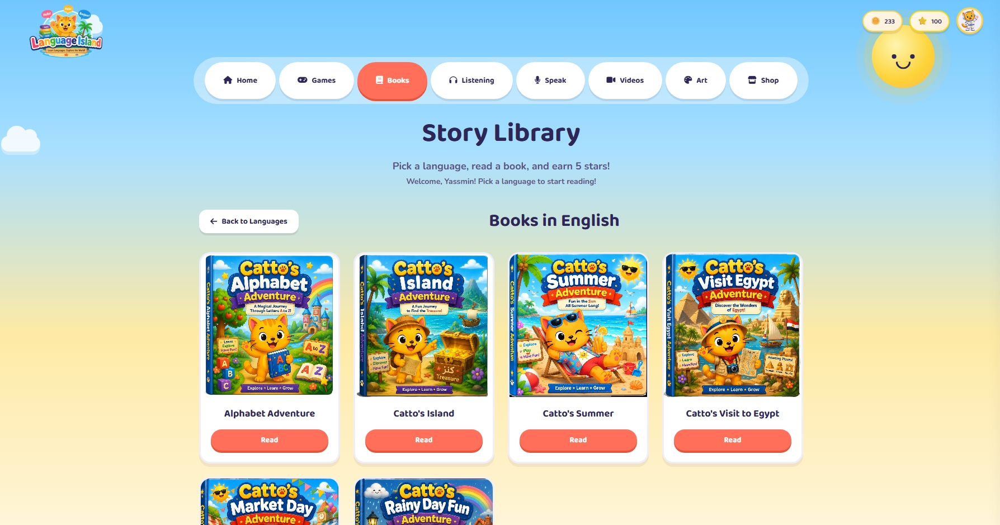</p>

## 🎧 Listening
<p align="center">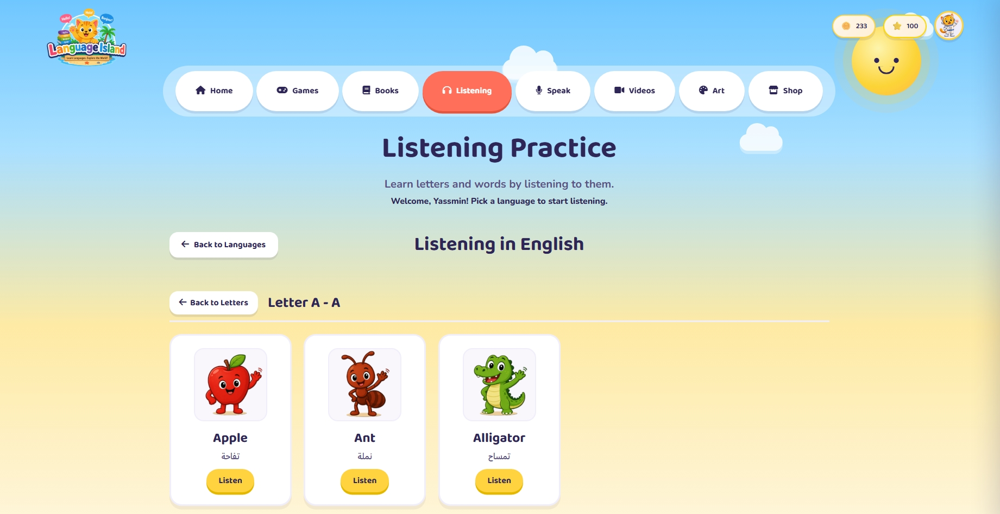</p>

## 🎤 Pronunciation
<p align="center">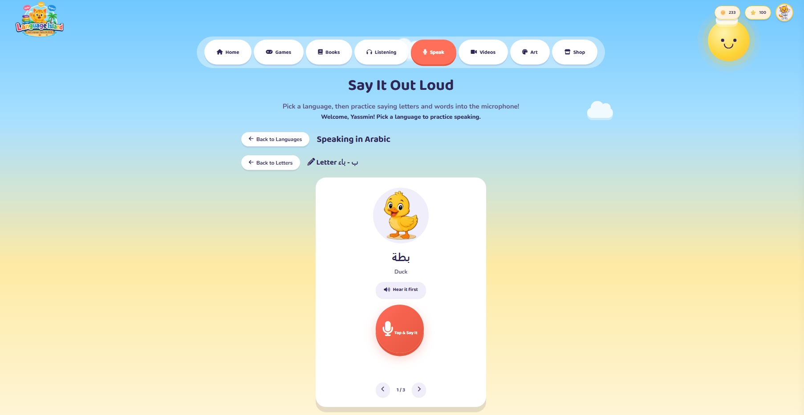</p>

## 🎨 Art
<p align="center">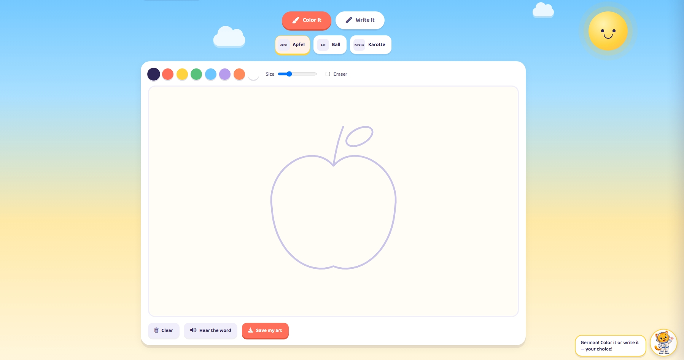</p>

## 🛒 Shop
<p align="center">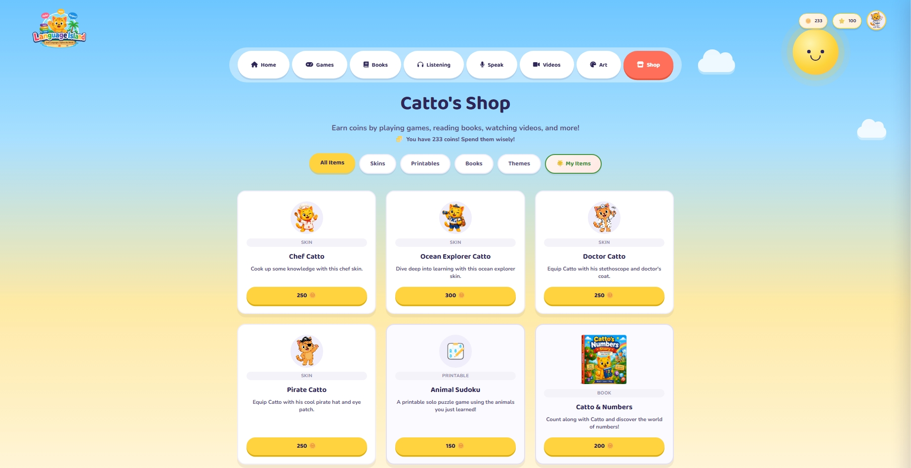</p>

## 👤 Profile
<p align="center">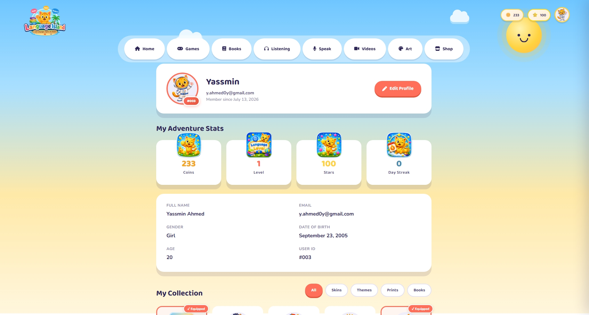</p>

## ⚙️ Settings & Themes
<p align="center"></p>

---

# ✨ Features

- 🌍 Multi-language learning
- 🎮 Educational games
- 📚 Interactive books
- 🎧 Listening activities
- 🎤 Pronunciation practice
- 🎨 Digital drawing
- 🛒 Virtual shop
- 👤 User profile
- 🐱 Catto companion

---

# 🛠️ Technology Stack

**Frontend:** HTML5, CSS3, JavaScript

**Backend:** PHP, MySQL

**Tools:** XAMPP, phpMyAdmin, VS Code, Git

---

# 🚀 Installation

```bash
git clone https://github.com/YassminAhmed10/Catto-Platform.git
```

Start Apache & MySQL, import the database, and open:

```
http://localhost/Catto-Platform/
```

---

# 👨‍💻 Development Team

| Name | Role |
|------|------|
| Yassmin Ahmed | Full Stack Developer |
| Areej Maher | Full Stack Developer |

---

# 📜 License

Educational project.

<div align="center">

### ⭐ If you like this project, give it a star!

Made with ❤️ by **Yassmin Ahmed** & **Areej Maher**

</div>
